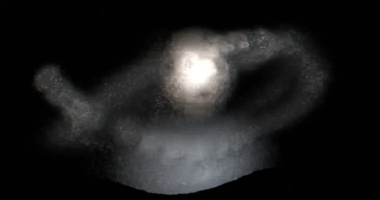
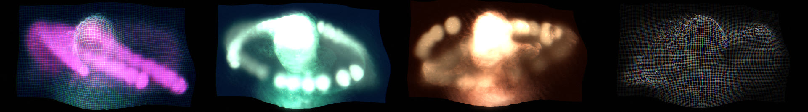

<div align="center">

# re/fraction

*you, as data.*

A webcam mirror that remembers.<br>
Your image becomes a slow, drifting, datamoshed surface, and your voice runs through a worn VHS tape.

[**open it in your browser**](https://hakdiriko.github.io/re-fraction/) &nbsp;·&nbsp; [run it locally](#run-locally) &nbsp;·&nbsp; [how it works](#how-it-works)

<br>



<sub>captured in demo mode, no camera</sub>

</div>

<br>

## what it is

**re/fraction** is a small instrument for the browser. Turn on your camera and microphone, and the picture stops being a window and becomes a memory: when you move, the old pixels stay and are replaced slowly, one grain at a time. Nothing falls, nothing beats, nothing is in a hurry. Sound only nudges the image, with long lag, like a slow LFO.

At the same time your voice goes through a voiceover chain of gate, compression, bit-crush, tape wow and flutter, hiss and a small room. You can listen live, record takes, and keep them.

Everything runs locally. Nothing is uploaded.

<br>

## run locally

It is a single `index.html` with no dependencies and no build step. Camera and mic need a secure context, so serve it from `localhost`:

```bash
git clone https://github.com/hakdiriko/re-fraction
cd re-fraction
python -m http.server 8000
```

Then open <http://localhost:8000> and press **start**, or **demo** to try it without a camera or mic.

Works best in a Chromium-based browser (Chrome, Edge, Arc). Wear headphones if you want to hear your own voice through the effects.

<br>

## keys

| | |
|:--|:--|
| `1` – `5` | looks: clear · neon · ember · aurora · wire |
| `R` / `T` | record / open takes |
| `P` | listen to the processed voice |
| `U` | clean view, no interface (for capture and streaming) |
| `H` · `F` · `S` · `M` | hide panel · fullscreen · save PNG · mirror |
| drag · wheel · double-click | orbit · zoom · reset view |



<br>

## how it works

```
camera ─→ optical flow ─→ datamosh memory ─→ 3D surface ─→ bloom · tape · grain ─→ screen
                                 ↑                ↑
                            face + voice     slow loudness
                                 ↑                ↑
mic ─→ gate ─→ comp ─→ crush ─→ tape ─→ room ─────┴─→ listen · record
```

- **Datamosh as memory.** Lucas–Kanade optical flow estimates how each region moved. A feedback buffer drags the previous picture along those vectors, and a per-pixel coin toss decides whether each pixel takes the live colour or keeps the old one. The more you move, the longer the past holds on.
- **A surface, not a video.** The mosh image is draped over a grid whose depth comes from its own brightness, floating in two slow, opposing noise fields. No gravity, no wind.
- **Slow sound.** The picture follows only a loudness envelope smoothed over one to two seconds. There is no beat detection anywhere, by design.
- **The voice.** A face detector (MediaPipe BlazeFace, running locally) finds your mouth. When you speak, old pixels drift gently outward from it.
- **The tape.** The audio chain is built from Web Audio nodes plus two small AudioWorklets (a self-calibrating noise gate and a soft bit-crusher). Five presets: vhs voiceover, clean voice, radio, dream tape, crushed.

Vanilla JavaScript, WebGL2, Web Audio. About 1,800 lines in a single file.

<br>

## privacy

Video and audio never leave your machine. The only network requests load the face-detection runtime and model (from jsDelivr and Google Storage), once. If they fail, the app keeps working with an assumed face position.

<br>

## license

[MIT](LICENSE). Use it, bend it, perform with it.

<br>

<div align="center"><sub>made by <a href="https://github.com/hakdiriko">hakan</a></sub></div>
